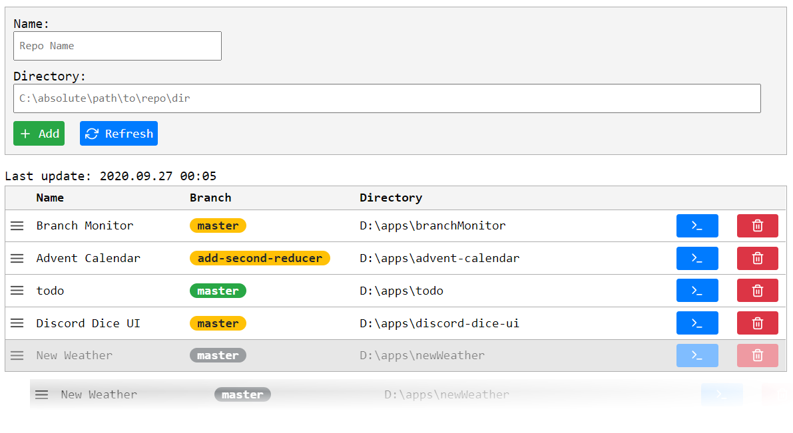

# Branch Monitor

> 🗄 Monitor your git branches from one place.

## Features

- runs on **JS** and **Express** server
- stores records in local **sqlite** database
- auto refreshes every 5 minutes
- _Refresh list_ button for manual update
- shows time of the last update
- branch pills with different colors

## Requirements
- Node.js
- Git

## How to

1. Checkout the repo on your drive.
2. Run `npm install` in the main directory.
3. Run `npm start`.  
	`npm start` command should bundle js files into one file in the `public` dir and start Node server.
4. The app uses port `3333`, so it should be available in your browser at:  
	http://localhost:3333/

